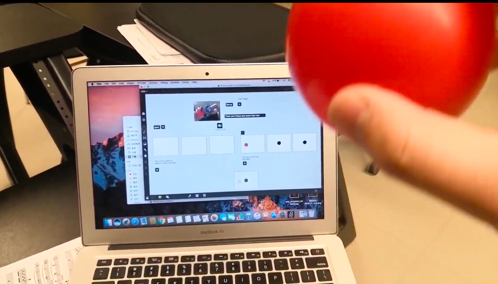

# MUMT306

My objective was initially to build up a orchestral conducting simulator. I would like to make a gestural control device that could control the speed and the dynamic of a sound file. The gesture would resemble a conventional conducting pattern. The sound file could be a piece an extra of a symphonic work. However, it is difficult to find a way to achieve this objective with limited knowledge and skills. Therefore, I have decided to work on something else. I have thought of the sonification of an image. I started looking at jitter object in Max/MSP. While I am learning how jitter objects work, I found out that jitter objects are good for video processing. I finally decided to combine both ideas I have together, to use camera as a video source to build a gestural controller, which is the final version of my final project.

The project consists of two main parts: video part and audio part.

The video part is using the camera as a video source. The user needs to hold several balloons of different colors in front of the camera to control the sound. The color of the balloons must be sampled at the beginning of every use. The reason is that the environment is different, the recognition of the displacement of the balloon is color sensitive. Even though there is certain level of tolerance for the color, we want to make sure that the color the program is attempting to recognize matches the color in front of the camera as much as it can. The suckah object is used to capture the color when the user click on the color. After clicking, the color is immediately stored and would be saved as a 3D vector, since light colors are made up of three colors: red, green and blue. A git.dindbounds object is used to find the color and outputs data about the distribution of the color in the image, including maximum and minimum coordinates of the colors in both x-axis and y-axis. Then a simple mathematical operation is used to average out those values that gives the coordinates of the center of the ball, which is a 2D vector, represents the x-axis and the y-axis. 

The output of the sound is stereo. The x-coordinates represent the position of the sound, when the ball is shifted to the left side, the sound on the left channel of the speaker would be louder, vice versa. The y-coordinate would represent the pitch of the sound. There is a mathematical operation that offsets the range of the number which makes the pitch and sound ranges adequate. Finally, the numbers are converted to MIDI numbers that represents notes. MIDI numbers are the converted to frequency value corresponding to that MIDI number, and a time varying additive synthesis is applied to synthesize the sound. A clarinet-like sound is synthesized by only having even-number harmonies. A gain~ object is used to adjust the volume of one color channel. And two other gain~ objects are used to adjust the position of the sound. 

To make it work, users need to switch to presentation mode, and follow steps. Step one is to click the start toggle that turns on everything, then click on OPEN to open the camera, it is important to have a camera, otherwise, it would not work. Step 3 is to click on the button that turns on jit.pwindow displaying virtual balls. Step 4 is to click on set up, and then follow the instruction in the message box on the right side of the camera jit.pwindow. The user could should have balloons of three different colors, and they have to hold the balloons in front of the camera, and scan, and click on the ballon in the camera video by following the instruction. Then the user could turn on the sound and adjust the volume of each track. The user could select the range of each track, between 6-48 semitones. Channels 1-3 only plays chromatic scales. 

There is an additional function, that uses the color of the channel 1 one to have some non-chromatic scales. There are three options: pentatonic, diatonic major, and diatonic harmonic minor. 

One issue about the project is that, initially, there were a metronome that triggers each notes. So when the balloon is immobile, there will be attacks on the note at each time the metronome sends a bang, which lacks continuity. To improve that, instead of a metronome, it is finally a change of MIDI number that triggers a note being played. As long as it is the same number, the note would be continuous. However, since the determination of the position of the ball is color sensitive, it happens that the signal is unstable even though the balloon seems not moved, which results a tremolo effect. 

I feel like I could keep implementing this final project after taking MUMT307 and MUMT501. With more DSP background, I think I could overcome struggles in controlling the dynamic of the sound. I hope I would be able to build up a good orchestra conducting simulator.

Here is a link for the project's demo: https://youtu.be/X-Lyw33R4Mg
